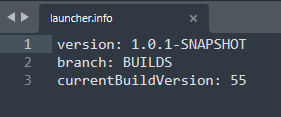
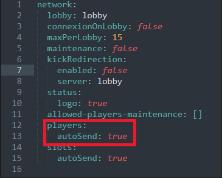
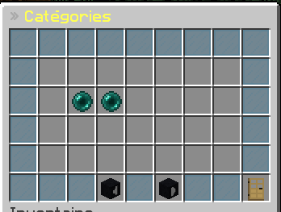
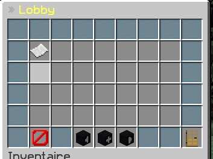
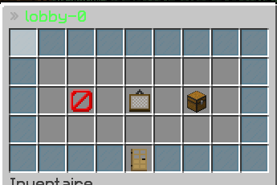
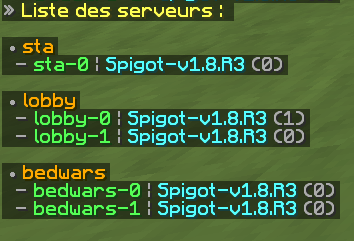

# 							**InterfaceManager**
*Interface de gestion des serveur via un menu en jeu*

## Instruction

**NE PAS OUBLIER DE METTRE EN VERSION DITE "BUILDS" DE DREAMNETWORK**
**DANS LE FICHIER "launcher.info" SANS ÇA RIEN NE MARCHE !!!!!!!**

Placez le fichier "[DN] InterfaceManager-1.0-SNAPSHOT.jar" dans le dossier "addons"

#### 

##### Pensez à bien mettre sur "true" cette option dans le fichier network.yml se trouvant dans le dossier plugin de votre proxy pour le bon fonctionnement du plugin

## Commandes

Commande pour afficher le menu : **/im** | Permission : **im.command.menu**

Commande pour afficher la liste des serveurs : **/im list** | Permission : **im.command.list**

Permission universelle : **im.admin**

## Screens

Quelques screens ......

> Fait par Joupiter | Si vous avez quelques problèmes ou erreurs veuillez me contacté via le discord de DreamNetwork : https://discord.com/invite/BpqR7W32XJ
